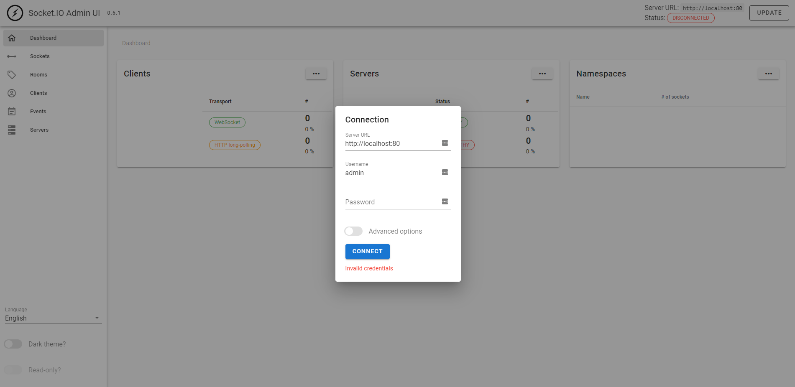
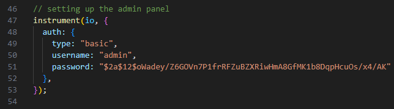

# Installation

On this page, there are two parts that are essential for the voice chat application to work properly. the first is hosting the voice chat server. the second is adding the files in your unity game and setting up some variables.

First, import the asset to your game. This will add all the files needed to get you started.

## Setting it up with your unity game

After importing the asset, the main script that you need to learn about and use will go by the name "**VoiceChatHandler.cs**", this script is singelton, so you can use it directly in any class you make. 

Tip: just make sure to add this script on a gameobject for the first scene, this is preferable to ensure running "SingletonAwakened" when your game start. this function initializes the voicechat script that will be loaded on the webpage that host the game.

the important thing that will need to change on the script editor will be the modification of two variables in the.

```C#
public string socketServer = "/";
public string clientJSFileURL = "/";
```


The first variable should contain the link to your website "https://your-server-domain", for it is used to communicate with the websocket server.

The second varialbe will be the link to the js file that contains the voice chat logic that is going to be imported into the webpage by unity. this file is important so that unity can start communicating with the server.

the link for the file should go like this (https://your-server-domain/js/client.js)

## Hosting the server

pre-requisites (for the hosting device): -

- npm
- node
- server running on HTTPS (required to get access to the mic, this is enforced from the browsers)

note: hosting the server on heroku provides an easier experince and the server comes with an ssl.

To begin with, the server can be found in "Assets/WebGLVoiceChat/VoiceChatServer.zip" from the imported asset, this zip includes the server that can be started using node js.

the link below shows how to host the server on heroku. However, you can host ther server on any platform of your choice.
[How to deploy to heroku](https://www.youtube.com/watch?v=DQk3zJlY-eE)

to run the server use

``
npm run prod
``

after setting up the server and hosting it, accessing the main page of the website will be empty but the server is being hosted.

you can also check the demo [here](https://geagle.tech/unity-webgl-voice-chat/).

## Allow Two way communitcation

starting from the update 0.7.0 the voice chat handler asset now uses two way communication. so the browser needs to have access to the unity instance.

in order to do this you need to modify the index.html file that comes with the webgl build where this line needs to be added


## How The voice chat starts

After adding the unity files to your game and providing the required URLs, you will have access to all the functionality of the voice chat library. However, none of them will be functional in the editor, for the functionality itself is executed on the browser with JavaScript.

the way it works is that when the game loads, the VCH (VoiceChatHandler) will instantiate itself (if used) and stay persistent throughout the game. On Start, the class will use the provided URLs from the class (in the editor) to do two things.

the first URL will be used as the domain to connect to the voice chat server, and the other URL will be the location of the voice chat script which will be used to append the script to the current HTML page by unity.

when the file loads, the class will be ready to be used.

## Admin Panel

Since update 0.8.0, there is an admin panel for the running server that can be accessed through "your-domain-name/Admin" e.g "localhost/Admin" the "A" in "Admin" is case sensitive.

once you enter the page, you should fill these three parameters



the first two should be somehting similar to the image above (the server url will change based on where it is hosted).

the password is defined from the server code, and should be chnaged from it



the image above showcases where the password can be changed. this code section can be found in the "index.js" file in the server zip.

the password should be encrypted with bcrypt and then inserted in the password property as in the picture above.

you can use a website like [bcrypt-generator](https://bcrypt-generator.com/) which will encrypt your password with the needed algorithm.

to learn more about the admin panel you can visit [this link](https://socket.io/docs/v4/admin-ui/).